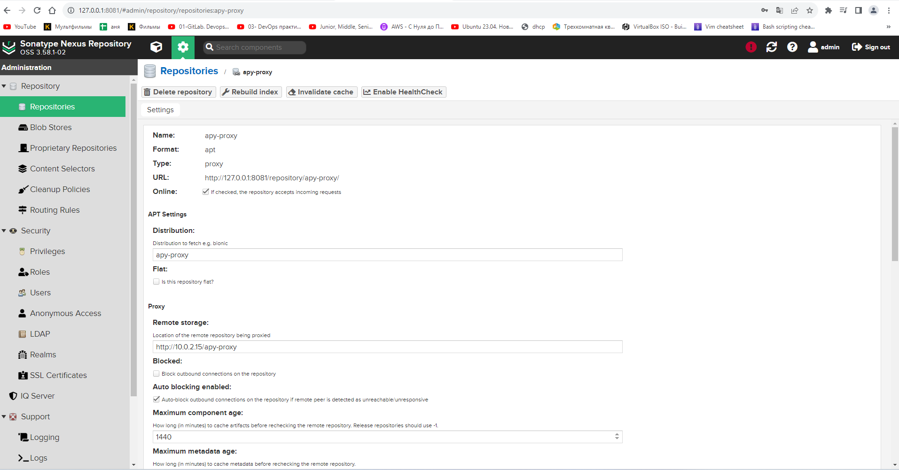
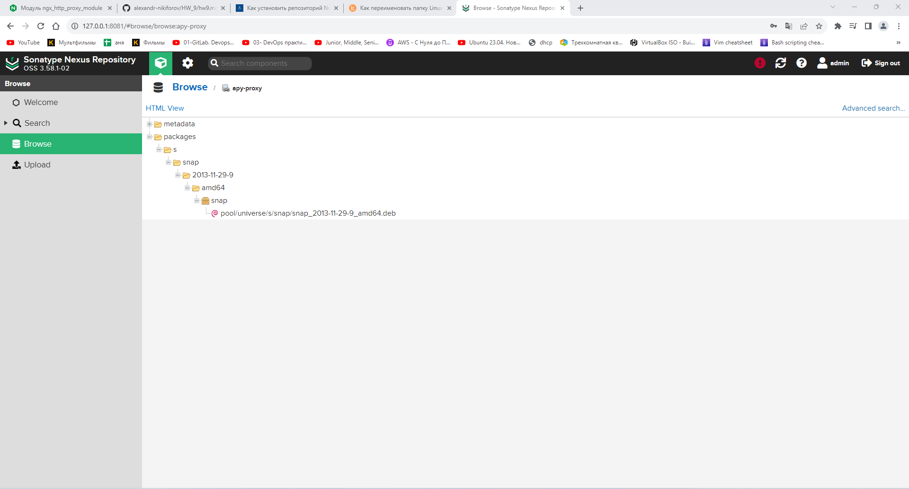

### 1. Добавить новый диск к виртуальной машине и проверить, что система видит его.
```bash
vagrant@vagrant:~$ lsblk
NAME           MAJ:MIN RM   SIZE RO TYPE MOUNTPOINTS
fd0              2:0    1     4K  0 disk
loop0            7:0    0  63.3M  1 loop /snap/core20/1822
loop1            7:1    0  49.8M  1 loop /snap/snapd/18357
loop2            7:2    0 111.9M  1 loop /snap/lxd/24322
sda              8:0    0    20G  0 disk
├─sda1           8:1    0     1M  0 part
├─sda2           8:2    0   500M  0 part /boot
└─sda3           8:3    0  19.5G  0 part
  └─lvm01-root 253:0    0    10G  0 lvm  /
sdb              8:16   0     2G  0 disk
sr0             11:0    1  1024M  0 rom

```
### 2. Вывести в консоль информацию по текущему размеру файловой системы.
```bash
vagrant@vagrant:~$ df -h
Filesystem              Size  Used Avail Use% Mounted on
tmpfs                   393M  1.1M  392M   1% /run
/dev/mapper/lvm01-root  9.8G  4.6G  4.7G  50% /
tmpfs                   2.0G     0  2.0G   0% /dev/shm
tmpfs                   5.0M     0  5.0M   0% /run/lock
/dev/sda2               452M  127M  291M  31% /boot
tmpfs                   393M  4.0K  393M   1% /run/user/1000


```
### 3. Расширить корневую файловую систему за счёт добавленного диска.
```bash
vagrant@vagrant:~$ sudo pvcreate /dev/sdb
[sudo] password for test:
  Physical volume "/dev/sdb" successfully created.
vagrant@vagrant:~$ sudo vgextend lvm01 /dev/sdb
  Volume group "lvm01" successfully extended
vagrant@vagrant:~$ sudo lvextend -l +100%FREE /dev/lvm01/root
  Size of logical volume lvm01/root changed from 10.00 GiB (2560 extents) to 21.50 GiB (5505 extents).
  Logical volume lvm01/root successfully resized.
vagrant@vagrant:~$ sudo resize2fs /dev/lvm01/root
resize2fs 1.46.5 (30-Dec-2021)
Filesystem at /dev/lvm01/root is mounted on /; on-line resizing required
old_desc_blocks = 2, new_desc_blocks = 3
The filesystem on /dev/lvm01/root is now 5637120 (4k) blocks long.


```
### 4. Вывести информацию по новому размеру файловой системы.
```bash
vagrant@vagrant:~$ df -h
Filesystem              Size  Used Avail Use% Mounted on
tmpfs                   393M  1.1M  392M   1% /run
/dev/mapper/lvm01-root   22G  4.6G   16G  23% /
tmpfs                   2.0G     0  2.0G   0% /dev/shm
tmpfs                   5.0M     0  5.0M   0% /run/lock
/dev/sda2               452M  127M  291M  31% /boot
tmpfs                   393M  4.0K  393M   1% /run/user/1000
vagrant@vagrant:~$ lsblk
NAME           MAJ:MIN RM   SIZE RO TYPE MOUNTPOINTS
fd0              2:0    1     4K  0 disk
loop0            7:0    0  63.3M  1 loop /snap/core20/1822
loop1            7:1    0  49.8M  1 loop /snap/snapd/18357
loop2            7:2    0 111.9M  1 loop /snap/lxd/24322
sda              8:0    0    20G  0 disk
├─sda1           8:1    0     1M  0 part
├─sda2           8:2    0   500M  0 part /boot
└─sda3           8:3    0  19.5G  0 part
  └─lvm01-root 253:0    0  21.5G  0 lvm  /
sdb              8:16   0     2G  0 disk
└─lvm01-root   253:0    0  21.5G  0 lvm  /
sr0             11:0    1  1024M  0 rom

```
### 5. Вывести в консоль текущую рабочую директорию.
```bash
vagrant@ubuntu-xenial:~$ pwd
/home/vagrant

```
### 6. Вывести в консоль все файлы из домашней директории.
```bash
vagrant@vagrant:~$ ls -al
total 36
drwxr-x--- 4 test test 4096 Aug 21 22:02 .
drwxr-xr-x 3 root root 4096 Aug 21 21:52 ..
-rw------- 1 test test   12 Aug 21 21:54 .bash_history
-rw-r--r-- 1 test test  220 Jan  6  2022 .bash_logout
-rw-r--r-- 1 test test 3771 Jan  6  2022 .bashrc
drwx------ 2 test test 4096 Aug 21 21:53 .cache
-rw-r--r-- 1 test test  807 Jan  6  2022 .profile
drwx------ 2 test test 4096 Aug 21 21:53 .ssh
-rw-r--r-- 1 test test    0 Aug 21 22:02 .sudo_as_admin_successful
-rw------- 1 test test   50 Aug 21 22:00 .Xauthority

```
### 7. Построить маршрут до google.com при помощи утилиты traceroute.
```bash
vagrant@vagrant:~$ traceroute google.com
traceroute to google.com (142.250.203.206), 30 hops max, 60 byte packets
 1  DESKTOP-SDPV7KD.mshome.net (172.20.64.1)  0.336 ms  0.320 ms  0.309 ms
 2  192.168.100.1 (192.168.100.1)  8.917 ms  7.730 ms  6.434 ms
 3  100.126.0.1 (100.126.0.1)  14.464 ms  14.451 ms  14.434 ms
 4  mm-57-80-84-93.dynamic.pppoe.mgts.by (93.84.80.57)  14.891 ms  15.225 ms  16.002 ms
 5  172.23.2.5 (172.23.2.5)  15.988 ms  15.976 ms  15.961 ms
 6  core1.net.belpak.by (93.85.80.45)  15.966 ms  14.164 ms  14.148 ms
 7  ie2.net.belpak.by (93.85.80.42)  14.104 ms  9.579 ms  8.323 ms
 8  asbr9.net.belpak.by (93.85.80.242)  5.240 ms  6.373 ms  9.959 ms
 9  74.125.146.96 (74.125.146.96)  21.589 ms  21.574 ms  16.802 ms
10  108.170.250.193 (108.170.250.193)  21.482 ms  21.467 ms 108.170.250.209 (108.170.250.209)  21.509 ms
11  209.85.250.175 (209.85.250.175)  16.697 ms  21.420 ms  21.406 ms
12  waw02s22-in-f14.1e100.net (142.250.203.206)  21.383 ms  21.369 ms  21.354 ms

```

### 8. Установить Sonatype Nexus OSS по следующей инструкции, а именно:
- установку произвести в директорию /opt/nexus.
- запустить приложение от отдельного пользователя nexus.
- реализовать systemd оболочку для запуска приложения как сервис.
```bash
vagrant@vagrant:~$ sudo apt-get update
vagrant@vagrant:~$ sudo apt install openjdk-8-jre
vagrant@vagrant:~$ wget https://download.sonatype.com/nexus/3/nexus-3.58.1-02-unix.tar.gz
vagrant@vagrant:~$ tar -zxvf latest-unix.tar.gz
vagrant@vagrant:~$ sudo mkdir /opt/nexus
vagrant@vagrant:~$ sudo tar -xvzf nexus-3.58.1-02-unix.tar.gz -C /opt/
vagrant@vagrant:~$ mv /opt/nexus-3.58.1-02/ /opt/nexus/
vagrant@vagrant:~$ sudo adduser nexus
vagrant@vagrant:~$ cat /etc/passwd |grep nexus
nexus:x:1001:1001:,,,:/home/nexus:/bin/bash
vagrant@vagrant:~$ sudo chown -R nexus:nexus /opt/nexus
vagrant@vagrant:~$ sudo chown -R nexus:nexus /opt/nexus/sonatype-work
vagrant@vagrant:~$ sudo nano /opt/nexus/bin/nexus.rc
...
run_as_user="nexus"
...
vagrant@vagrant:~$ sudo visudo
...
nexus ALL=(ALL) NOPASSWD: ALL
...
vagrant@vagrant:~$ sudo nano /etc/systemd/system/nexus.service
...
[Unit]
Description=nexus service
After=network.target
[Service]
Type=forking
LimitNOFILE=65536
ExecStart=/opt/nexus/bin/nexus start
ExecStop=/opt/nexus/bin/nexus stop
User=nexus
Restart=on-abort
[Install]
WantedBy=multi-user.target
...
vagrant@vagrant:~$ sudo systemctl daemon-reload
vagrant@vagrant:~$ sudo systemctl enable nexus
vagrant@vagrant:~$ sudo systemctl start nexus

```
### 9. Создать в Nexus proxy репозиторий для пакетов ОС и разрешить анонимный доступ.



### 10. Поменять для текущей VM основной репозиторий пакетов на созданный ранее proxy в Nexus.

```bash
deb http://127.0.0.1:8081/repository/apy-proxy/ focal main restricted
deb http://127.0.0.1:8081/repository/apy-proxy/ focal-updates main restricted
deb http://127.0.0.1:8081/repository/apy-proxy/ focal universe
deb http://127.0.0.1:8081/repository/apy-proxy/ focal-updates universe
deb http://127.0.0.1:8081/repository/apy-proxy/ focal multiverse
deb http://127.0.0.1:8081/repository/apy-proxy/ focal-updates multiverse
deb http://127.0.0.1:8081/repository/apy-proxy/ focal-backports main restricted universe multiverse
deb http://127.0.0.1:8081/repository/apy-proxy/ focal-security main restricted
deb http://127.0.0.1:8081/repository/apy-proxy/ focal-security universe
deb http://127.0.0.1:8081/repository/apy-proxy/ focal-security multiverse

```

### 11. Выполнить установку пакета snap и убедиться, что на proxy репозитории в Nexus появились пакеты.



### 12. (**) На основании шагов из предыдущих пунктов создать DEB/RPM пакет для установки Nexus и загрузить его в Nexus.

