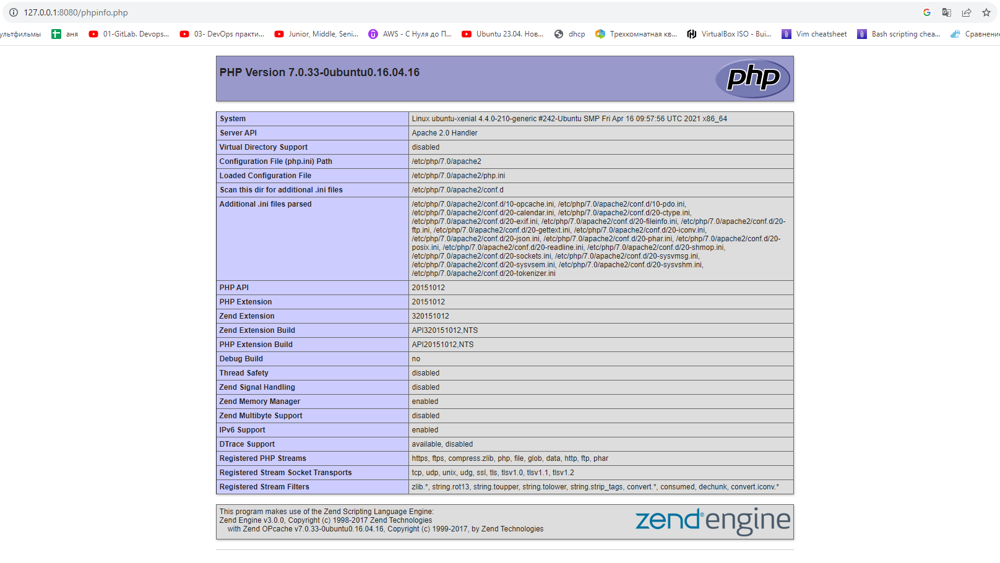
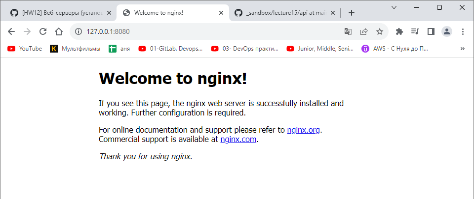
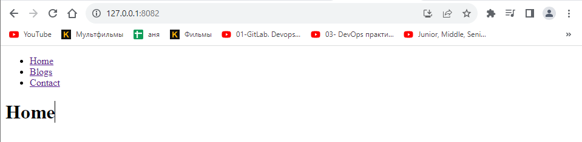
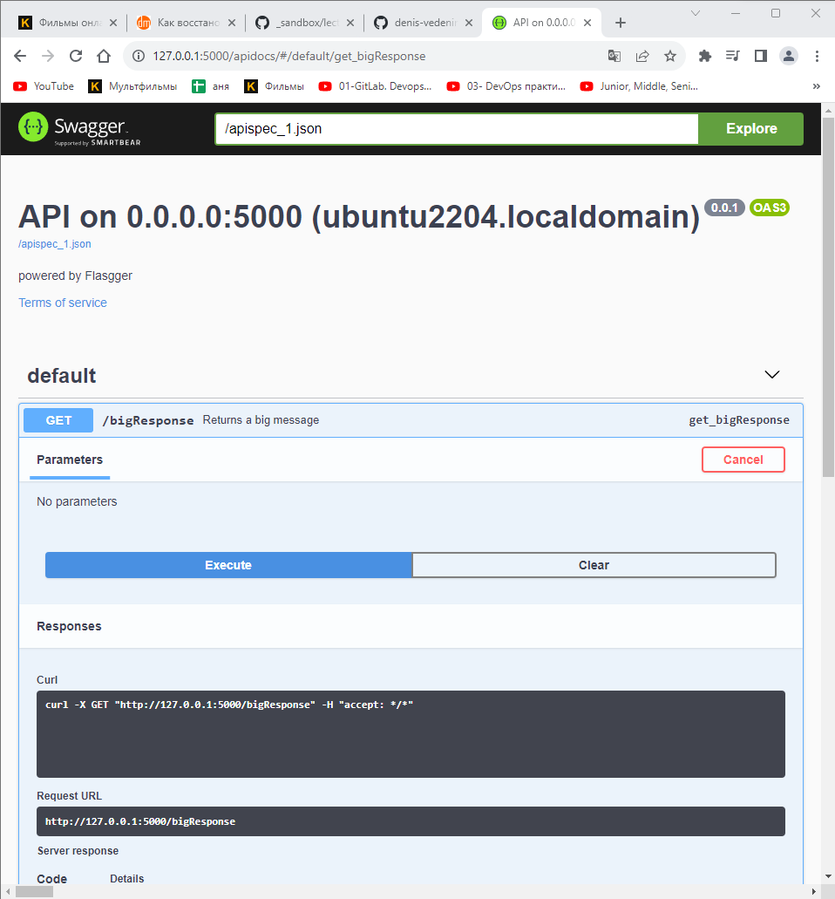
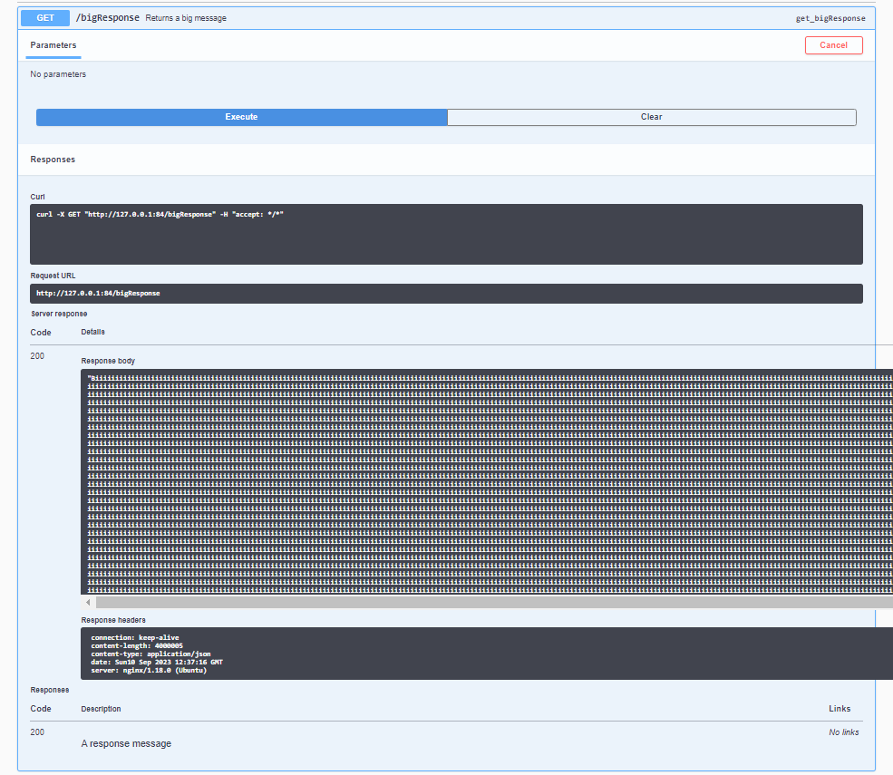
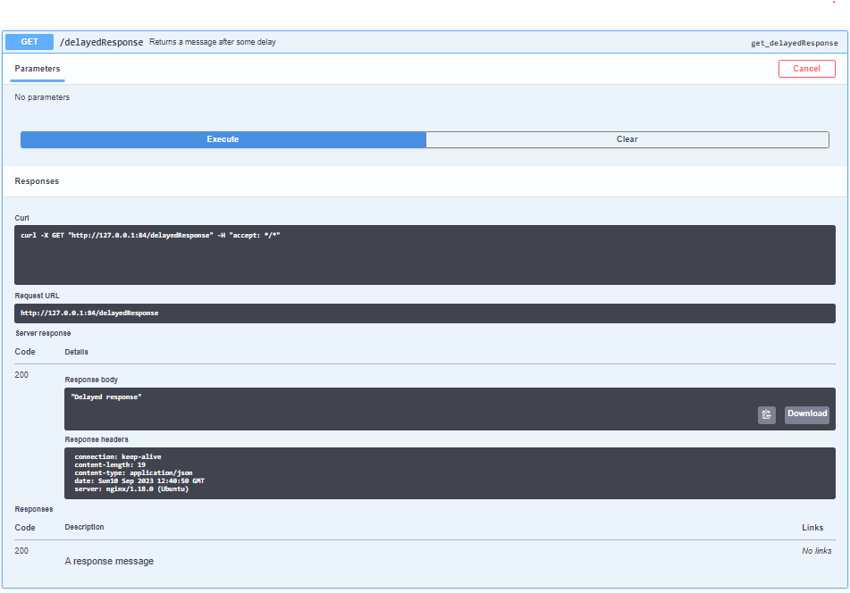
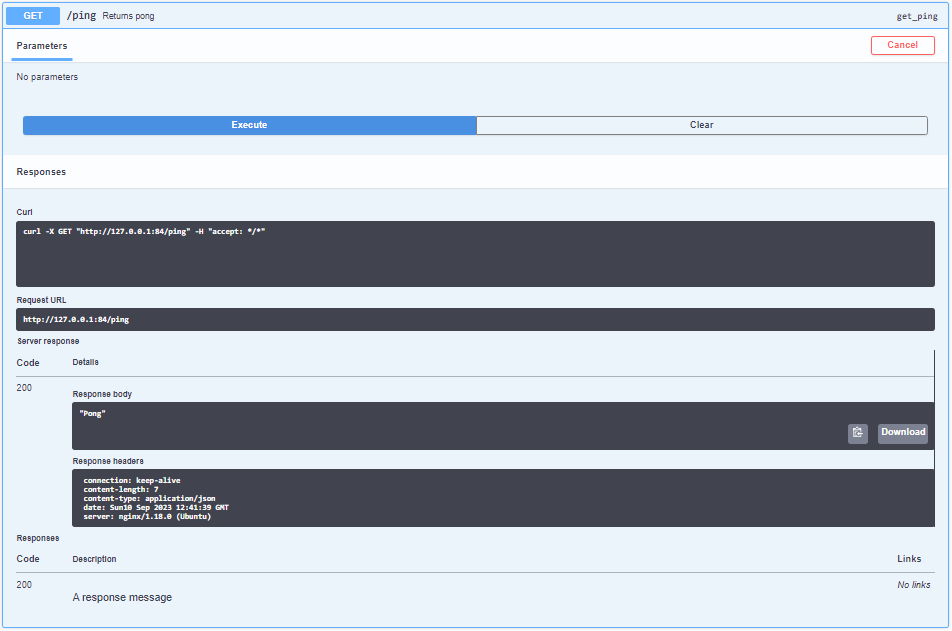
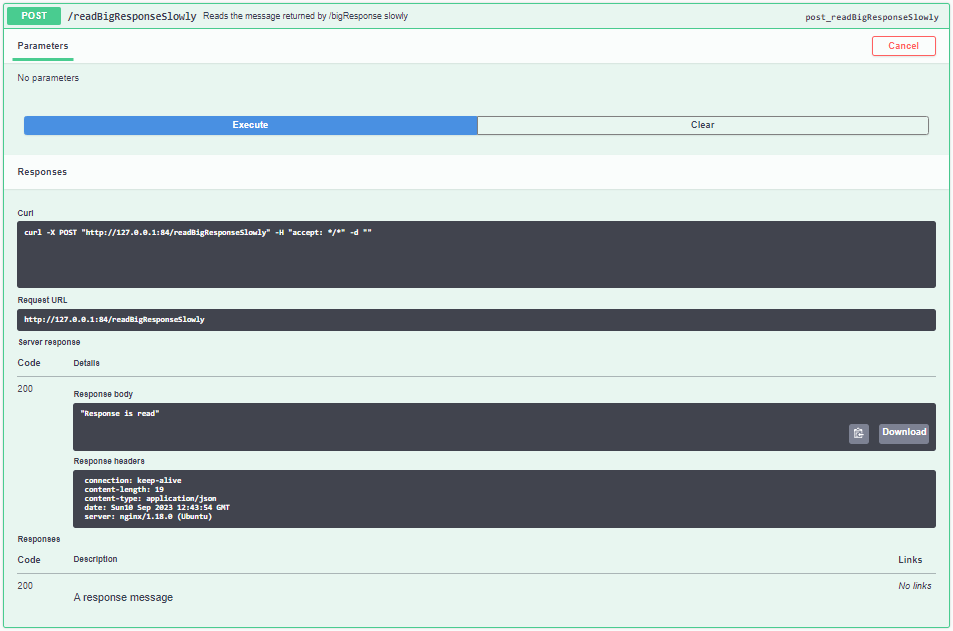
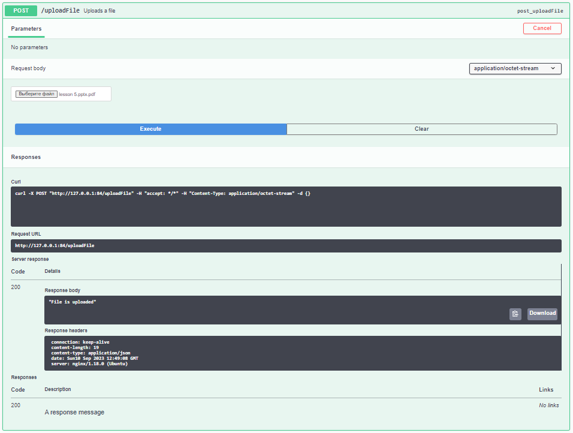

### 1. Установить Apache веб-сервер на VM и настроить его на работу с PHP (например, как указано в инструкции. Поменять порт по умолчанию на 8080. Убедиться, что Apache работает и возвращает страницу с информацией о PHP.
```bash
vagrant@ubuntu-xenial:~$ sudo apt install php libapache2-mod-php
vagrant@ubuntu-xenial:~$ sudo vi /etc/apache2/ports.conf
vagrant@ubuntu-xenial:~$ cat vi /etc/apache2/ports.conf
cat: vi: No such file or directory
# If you just change the port or add more ports here, you will likely also
# have to change the VirtualHost statement in
# /etc/apache2/sites-enabled/000-default.conf

Listen 8080

<IfModule ssl_module>
        Listen 443
</IfModule>

<IfModule mod_gnutls.c>
        Listen 443
</IfModule>

# vim: syntax=apache ts=4 sw=4 sts=4 sr noet

```


### 2. Установить Nginx на VM.
```bash
vagrant@ubuntu-xenial:~$ sudo apt update
vagrant@ubuntu-xenial:~$ sudo apt install nginx
vagrant@ubuntu-xenial:~$ systemctl status nginx
● nginx.service - A high performance web server and a reverse proxy server
   Loaded: loaded (/lib/systemd/system/nginx.service; enabled; vendor preset: enabled)
   Active: active (running) since Sun 2023-09-03 10:47:40 UTC; 5min ago
 Main PID: 6581 (nginx)
    Tasks: 3
   Memory: 3.8M
      CPU: 96ms
   CGroup: /system.slice/nginx.service
           ├─6581 nginx: master process /usr/sbin/nginx -g daemon on; master_process o
           ├─6582 nginx: worker process
           └─6583 nginx: worker process

```


### 3. Скопировать папку https://github.com/tms-dos17-onl/_sandbox/tree/main/lecture15/react_nginx/build на VM и настроить Nginx на хостинг этого веб-приложения. Проверить работоспособность приложения путем посещения всех доступных ссылок на главной странице и обновления каждой из страниц в веб-браузере.
```bash
vagrant@ubuntu2204:~$ sudo cp -r _sandbox/lecture15/react_nginx/build/ /var/www/
vagrant@ubuntu2204:~$ sudo touch /etc/nginx/conf.d/react_nginx.conf
vagrant@ubuntu2204:~$ sudo nano /etc/nginx/conf.d/react_nginx.conf

```


### 4. Скопировать папку https://github.com/tms-dos17-onl/_sandbox/tree/main/lecture15/api на VM и запустить Python REST Api приложение согласно инструкции. Проверить работоспособность всех доступных REST Api методов с помощью Swagger.
```bash
vagrant@ubuntu2204:~$ sudo cp -r _sandbox/lecture15/api/ /var/www/
vagrant@ubuntu-xenial:~$ sudo apt install python3 python3-pip
vagrant@ubuntu2204:~$ pip install -r _sandbox/lecture15/api/requirements.txt
vagrant@ubuntu2204:~$ python3 /var/www/api/mail.py

```


### 5. Настроить Nginx как Reverse Proxy для Python REST Api приложения из предыдущего пункта. А затем:
- Открыть Swagger для веб-приложения через Nginx (http://<NGINX_IP>:<NGINX_PORT>/apidocs).
- Проверить работоспособность всех доступных REST Api методов через Nginx с помощью Swagger. Убедиться, что нет ошибок ни в выводе Rest Api приложения, ни в HTTP ответе в Swagger. При необходимости поправить конфигурацию Nginx сервера, чтобы все методы работали.
- Для тестирования метода /uploadFile использовать файл размером больше 1MB.
- Вывести в консоль содержимое файла конфигурации Nginx с измененными значениями и комментариями.











```bash
127.0.0.1 - - [10/Sep/2023 12:37:16] "GET /bigResponse HTTP/1.0" 200 -
127.0.0.1 - - [10/Sep/2023 12:40:50] "GET /delayedResponse HTTP/1.0" 200 -
127.0.0.1 - - [10/Sep/2023 12:41:39] "GET /ping HTTP/1.0" 200 -
127.0.0.1 - - [10/Sep/2023 12:42:52] "GET /bigResponse HTTP/1.0" 200 -
127.0.0.1 - - [10/Sep/2023 12:43:54] "POST /readBigResponseSlowly HTTP/1.0" 200 -
127.0.0.1 - - [10/Sep/2023 12:45:43] "POST /uploadFile HTTP/1.0" 200 -

```

```bash
vagrant@ubuntu2204:~$ sudo nano /etc/nginx/conf.d/proxy_api.conf
server {
       listen 84;
       listen [::]:84;

       server_name api.test;

       root /var/www/api;

       index index.html;

       location / {
                proxy_pass http://127.0.0.1:5000/;
                rewrite /(.*) /$1 break;
                proxy_set_header    Host $host;
                proxy_set_header    X-Real-IP $remote_addr;
                proxy_set_header    X-Forwarded-For $proxy_add_x_forwarded_for;
                proxy_set_header    X-Forwarded-Proto $scheme;
                proxy_read_timeout 100;
                proxy_send_timeout 100;
                proxy_connect_timeout 100;
                client_max_body_size 20M;
        }
}

```