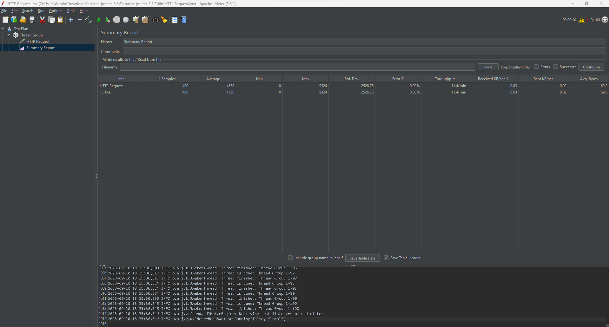
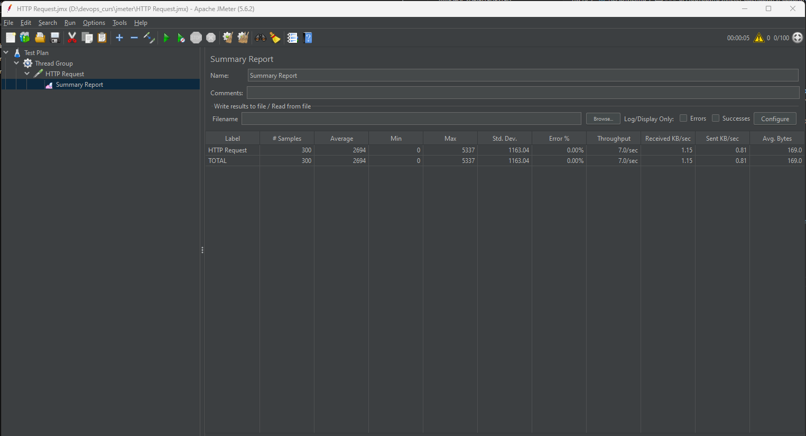

### 1. Скопировать папку https://github.com/tms-dos17-onl/_sandbox/tree/main/lecture15/api на VM и запустить Python REST Api приложение согласно инструкции. Проверить работоспособность всех доступных REST Api методов с помощью Swagger.
```
HW12 см. п.4

```

### 2. Установить Nginx на VM и настроить его как Reverse Proxy для Python REST Api приложения из предыдущего пункта.
```
HW12 см. п.5

```

### 3. Установить JMeter и написать тестовый сценарий для проверки производительности приложения путем выполнения HTTP GET запроса http://<NGINX_IP>:<NGINX_PORT>/ping от 100 пользователей.
```bash


```

### 4. Запустить ещё один экземпляр Python REST Api приложения на другом порту.
```bash
vagrant@ubuntu2204:~$ python3 _sandbox/lecture15/api/main.py 5050
 * Serving Flask app 'main'
 * Debug mode: on
WARNING: This is a development server. Do not use it in a production deployment. Use a production WSGI server instead.
 * Running on all addresses (0.0.0.0)
 * Running on http://127.0.0.1:5050
 * Running on http://10.0.2.15:5050
Press CTRL+C to quit
 * Restarting with stat
 * Debugger is active!
 * Debugger PIN: 137-791-768

```

### 5. Изменить конфигурацию Nginx, чтобы он использовал в качестве бэкенда 2 приложения.
```bash
upstream backend {
    server 127.0.0.1:5000;
    server 127.0.0.1:5050;
}

server {
       listen 84;
       listen [::]:84;

       server_name api.test;

       root /var/www/api;

       index index.html;

       location / {
                proxy_pass http://backend/;
                rewrite /(.*) /$1 break;
                proxy_set_header    Host $host;
                proxy_set_header    X-Real-IP $remote_addr;
                proxy_set_header    X-Forwarded-For $proxy_add_x_forwarded_for;
                proxy_set_header    X-Forwarded-Proto $scheme;
                proxy_read_timeout 100;
                proxy_send_timeout 100;
                proxy_connect_timeout 100;
                client_max_body_size 20M;
        }
}

```

### 6. Повторить JMeter сценарий и сравнить результаты.

По результатам нагрузочного тестирования, видно что изменилось время выполнения запросов. Также изменилась пропускная способность приложения. 





