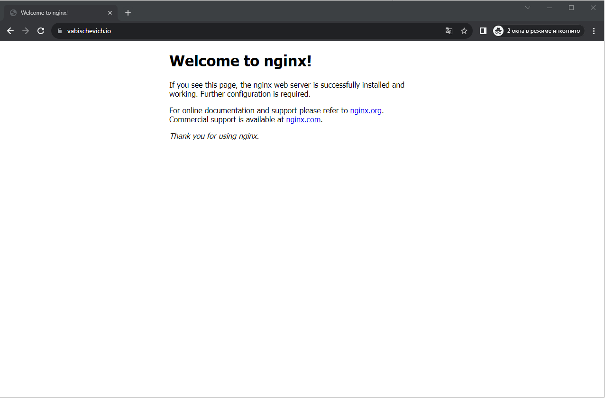
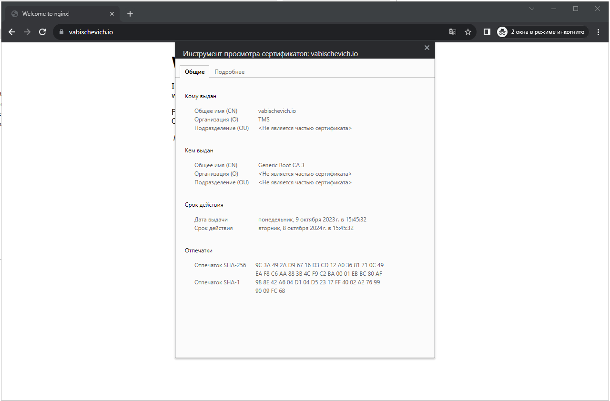
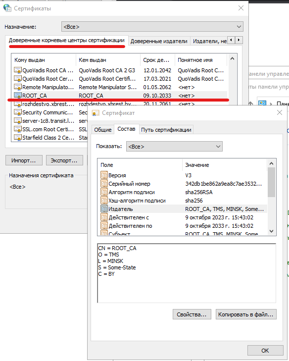
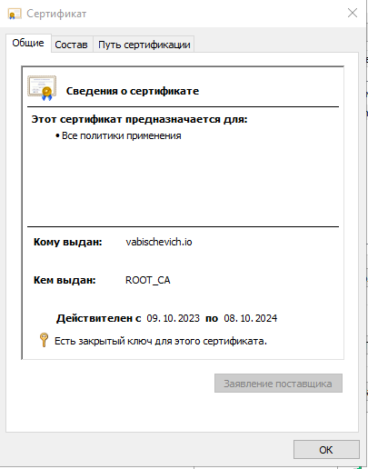

### 1. Сгенерировать пару ключей/сертификатов (private.pem и public.pem) при помощи OpenSSL.
```bash
vagrant@ubuntu-xenial:~$ openssl genrsa -out private.pem 2048
Generating RSA private key, 2048 bit long modulus
......................................................................................................................+++
..............................................+++
e is 65537 (0x10001)
vagrant@ubuntu-xenial:~$ openssl rsa -in private.pem -out public.pem -outform PEM -pubout
writing RSA key

```
### 2. Создать скрипт encrypt.sh, который считывает стандартный поток ввода, шифрует его при помощи public.pem через OpenSSL и выводит в стандартный поток вывода.
```bash
vagrant@ubuntu-xenial:~$ cat encrypt.sh
#!/bin/bash
now=$(date +"%Y.%m.%d.%H.%M")
openssl rsautl -encrypt -pubin -inkey public.pem  -out encript.$now
vagrant@ubuntu-xenial:~$ echo "esxeeexexe" | bash encrypt.sh
vagrant@ubuntu-xenial:~$ cat encript.2023.09.21.14.25
sm$D#HSk7vZ8inAxFwo7̗PL",I:%pӔ'2^w
                                                            wΦm7$Jej"QySǖE!ge#W
```


### 3. Создать скрипт decrypt.sh, который считывает стандартный поток ввода, расшифровывает его при помощи private.pem через OpenSSL и выводит в стандартный поток вывода.
```bash
vagrant@ubuntu-xenial:~$ cat decrypt.sh
#!/bin/bash
now=$(date +"%Y.%m.%d.%H.%M")
openssl rsautl -decrypt -inkey private.pem -out decrypt.$now

vagrant@ubuntu-xenial:~$ cat encript.2023.09.21.14.25 | bash decrypt.sh 
vagrant@ubuntu-xenial:~$ cat decrypt.2023.09.21.14.35
esxeeexexe
```

vagrant@ubuntu-xenial:~$ cat encript.2023.09.21.14.25 | bash decrypt.sh 
vagrant@ubuntu-xenial:~$ cat decrypt.2023.09.21.14.35
esxeeexexe
```
### 4. Сгенерировать публичный сертификат public-nginx.pem для private.pem через OpenSSL, используя <LASTNAME>.io в качестве Common Name (CN).
```bash
test@test:~$ openssl req   -subj -x509 -sha256 -days 3653 -newkey rsa:2048 -keyout root_ca.key -out root_ca.crt

test@test:~$ openssl genrsa -out vabischevich.io.key  2048

test@test:~$ openssl req  -new -subj -key vabischevich.io.key -out vabischevich.io.csr

test@test:~$ openssl x509 -req -CA root_ca.crt -CAkey root_ca.key -in vabischevich.io.csr -out vabischevich.io.crt -days 365  -CAcreateserial  -extfile vabischevich.ext 

test@test:~$ cat vabischevich.crt root.crt > vabischevich_full.crt

test@test:~$ openssl pkcs12 -export -in vabischevich_full.crt -inkey vabischevich.io.key -name vabischevich.io -out keystore.p12

```
### 5. Настроить Nginx на работу по HTTPS, используя сертификаты из предыдущего задания. Например, чтобы Nginx возвращал домашнюю страницу по HTTPS.
```bash
test@test:~$ sudo nano /etc/nginx/sites-enabled/default
...
server {
        listen 80 default_server;
        listen [::]:80 default_server;

        listen 443 ssl default_server;

        ssl_certificate     /etc/ssl/vabischevich.io.crt;
        ssl_certificate_key /etc/ssl/vabischevich.io.key;

        root /var/www/html;

        server_name vabischevich.io;

        location / {
                try_files $uri $uri/ =404;
        }
}
```



```bash


```
### 6. Настроить доверие публичному сертификату в браузере и проверить это.



### 7. А теперь открыть домашнюю страницу Nginx по HTTPS через curl не прибегая к опции -k.
```bash
test@by-115:/mnt/c/Users/vabischevich/Documents/test$ curl --cacert root_ca.crt https://vabischevich.io
<!DOCTYPE html>
<html>
<head>
<title>Welcome to nginx!</title>
<style>
    body {
        width: 35em;
        margin: 0 auto;
        font-family: Tahoma, Verdana, Arial, sans-serif;
    }
</style>
</head>
<body>
<h1>Welcome to nginx!</h1>
<p>If you see this page, the nginx web server is successfully installed and
working. Further configuration is required.</p>

<p>For online documentation and support please refer to
<a href="http://nginx.org/">nginx.org</a>.<br/>
Commercial support is available at
<a href="http://nginx.com/">nginx.com</a>.</p>

<p><em>Thank you for using nginx.</em></p>
</body>
</html>
```