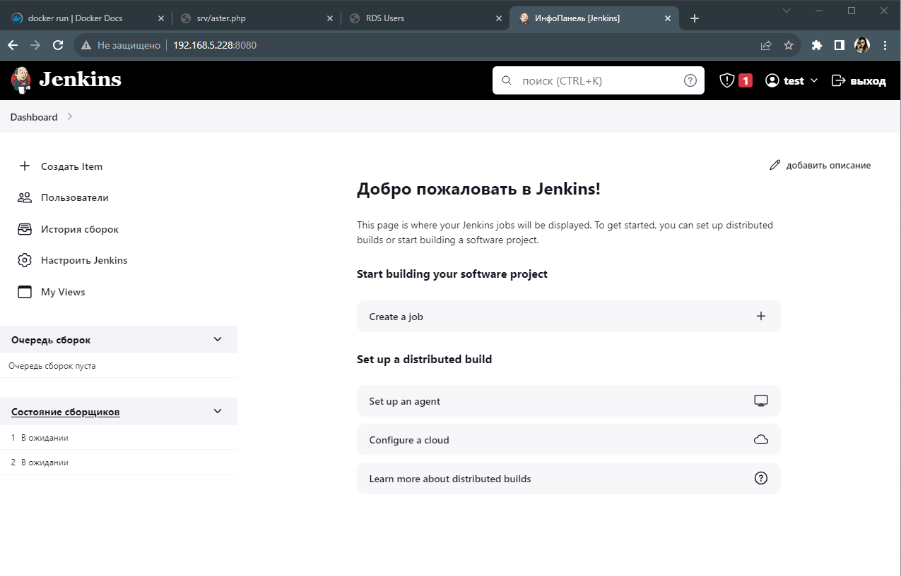

### 1. Установить Docker на хостовую ОС. В случае с Windows использовать WSL backend.
```bash
test@test:~$ sudo apt-get update
test@test:~$ sudo apt-get install ca-certificates curl gnupg
test@test:~$ sudo install -m 0755 -d /etc/apt/keyrings
test@test:~$ curl -fsSL https://download.docker.com/linux/ubuntu/gpg | sudo gpg --dearmor -o /etc/apt/keyrings/docker.gpg
test@test:~$ sudo chmod a+r /etc/apt/keyrings/docker.gpg
test@test:~$ echo \
  "deb [arch="$(dpkg --print-architecture)" signed-by=/etc/apt/keyrings/docker.gpg] https://download.docker.com/linux/ubuntu \
  "$(. /etc/os-release && echo "$VERSION_CODENAME")" stable" | \
  sudo tee /etc/apt/sources.list.d/docker.list > /dev/null
test@test:~$ sudo apt-get update
test@test:~$ sudo apt-get install docker-ce docker-ce-cli containerd.io docker-buildx-plugin docker-compose-plugin
```

### 2. Убедиться, что Docker работает исправно путем запуска контейнера hello-world.
```bash
test@test:~$ sudo docker run --rm -it hello-world
Unable to find image 'hello-world:latest' locally
latest: Pulling from library/hello-world
719385e32844: Pull complete
Digest: sha256:4f53e2564790c8e7856ec08e384732aa38dc43c52f02952483e3f003afbf23db
Status: Downloaded newer image for hello-world:latest

Hello from Docker!
This message shows that your installation appears to be working correctly.

To generate this message, Docker took the following steps:
 1. The Docker client contacted the Docker daemon.
 2. The Docker daemon pulled the "hello-world" image from the Docker Hub.
    (amd64)
 3. The Docker daemon created a new container from that image which runs the
    executable that produces the output you are currently reading.
 4. The Docker daemon streamed that output to the Docker client, which sent it
    to your terminal.

To try something more ambitious, you can run an Ubuntu container with:
 $ docker run -it ubuntu bash

Share images, automate workflows, and more with a free Docker ID:
 https://hub.docker.com/

For more examples and ideas, visit:
 https://docs.docker.com/get-started/

```

### 3. Установить Nginx используя Docker образ
```bash
test@test:~$ sudo docker pull nginx
test@test:~$ sudo docker run --name webtest -p 80:80 nginx
test@test:~$ sudo docker ps -a
CONTAINER ID   IMAGE         COMMAND                  CREATED          STATUS                      PORTS     NAMES
c946dc2f9dde   nginx         "/docker-entrypoint.…"   2 minutes ago    Created                               webtest
d7befd5d31e8   hello-world   "/hello"                 12 minutes ago   Exited (0) 12 minutes ago             zen_blackburn
test@test:~$ curl  127.0.0.1:80
<!DOCTYPE html>
<html>
<head>
<title>Welcome to nginx!</title>
<style>
    body {
        width: 35em;
        margin: 0 auto;
        font-family: Tahoma, Verdana, Arial, sans-serif;
    }
</style>
</head>
<body>
<h1>Welcome to nginx!</h1>
<p>If you see this page, the nginx web server is successfully installed and
working. Further configuration is required.</p>

<p>For online documentation and support please refer to
<a href="http://nginx.org/">nginx.org</a>.<br/>
Commercial support is available at
<a href="http://nginx.com/">nginx.com</a>.</p>

<p><em>Thank you for using nginx.</em></p>
</body>
</html>

```
### 4. Изучить следующие команды и их флаги:
- docker run (-i, -t, -d, --rm)
```bash
docker run -i -подключаем потов ввода 
docker run -t - подключаем консоль
docker run -d - запускаем контейнер в фоне
docker run --rm - удаляем контейнер после завершения сессии
```

- docker ps (-a, -l, -q)
```bash
docker ps -a -подключаем потов ввода 
docker ps -l - подключаем консоль
docker ps -q - запускаем контейнер в фоне
```

- docker images
```bash
Выводит список загруженых(созданых) образов контейнеров 
```

- docker start/docker stop/docker restart
```bash
docker start - запустить установленый контейнер
docker stop - остановить установленый контейнер
docker restart - перезагрузить установленый контейнер
```

- docker exec
```bash
Выполняет команду в запущенном контейнере.
```

### 5. Установить Nexus используя Docker образ
```bash
test@test:~$ sudo docker pull sonatype/nexus3
Using default tag: latest
latest: Pulling from sonatype/nexus3
967391cae45a: Pull complete
13ba478eb6c3: Pull complete
c9b100a53c81: Pull complete
ae9e60596df5: Pull complete
c28fcbc1dd43: Pull complete
90bde46ccbb5: Pull complete
2cf0059fbc16: Pull complete
Digest: sha256:935c2ef24392cd446c9670d935378d0824ec7d7dc0d3a38902e958f400457808
Status: Downloaded newer image for sonatype/nexus3:latest
docker.io/sonatype/nexus3:latest
test@test:~$ sudo docker run -d -it -p 8080:80 --name nexus sonatype/nexus3
test@test:~$ sudo docker ps -a
CONTAINER ID   IMAGE             COMMAND                  CREATED              STATUS                         PORTS                                             NAMES
90a40d43478e   sonatype/nexus3   "/opt/sonatype/nexus…"   About a minute ago   Up About a minute              8081/tcp, 0.0.0.0:8080->80/tcp, :::8080->80/tcp   nexus

```

### 6. Установить Jenkins используя Docker образ
```bash
test@test:~$ sudo docker pull  jenkins/jenkins:lts
lts: Pulling from jenkins/jenkins
012c0b3e998c: Pull complete
f6154b0007a4: Pull complete
5e0093fb8d5f: Pull complete
34d373595578: Pull complete
10cad8b7dbf8: Pull complete
2471c7529ac3: Pull complete
655eafc42723: Pull complete
3145851d1a67: Pull complete
614d8a8c6a95: Pull complete
95f5dcd4e08b: Pull complete
7c8f869ed080: Pull complete
3a7be85a26d2: Pull complete
d754f693a7c2: Pull complete
Digest: sha256:b705323eaf70a7da4c1eed8b816f33dff2d5c8c3671170a2c17cf77aa4f15432
Status: Downloaded newer image for jenkins/jenkins:lts
docker.io/jenkins/jenkins:lts
test@test:~$ sudo docker run --name myjenkins1 -v /var/jenkins_hom:/var/jenkins_home -p 8080:8080 -p 50000:50000 jenkins/jenkins
```
