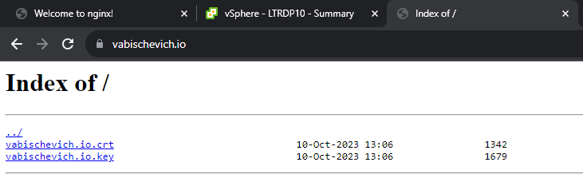
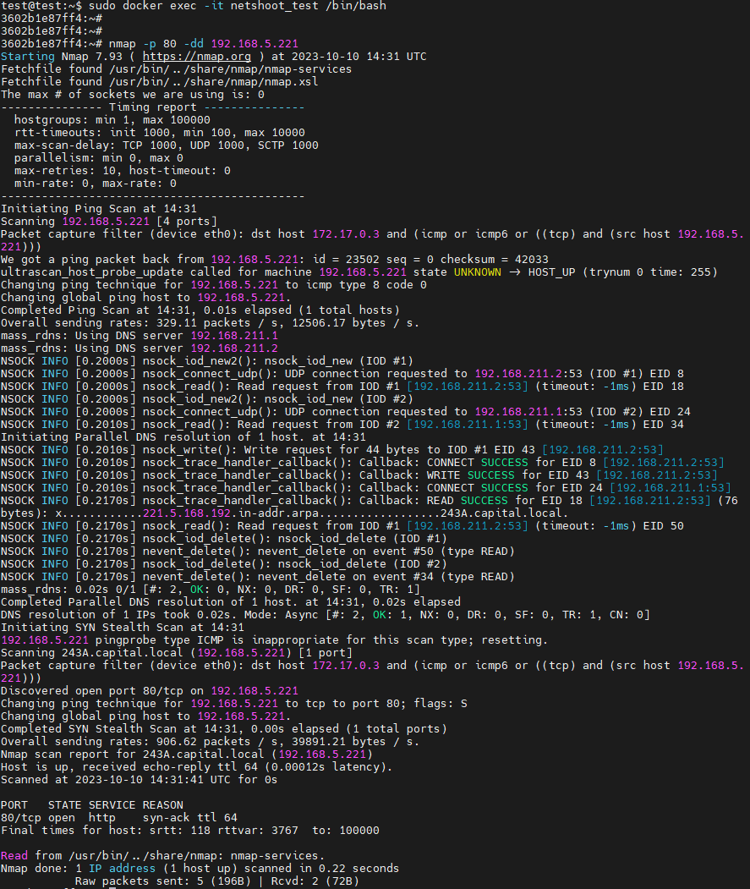

### 1. Установить Nginx и смонтировать в него:
- конфигурационный файл с хоста, который выполняет настройку HTTPS для страницы по умолчанию
- директорию с сертификатами
```bash
test@test:~$ sudo docker run --name nginx_hw19_t1 --rm -it -d -v /etc/nginx/sites-enabled/default:/etc/nginx/conf.d/vabischevich.conf:ro -v /etc/nginx/cert/:/etc/nginx/cert/ -p 80:80 -p 443:443 nginx
afdbf1f7443739ef90fa667abaf448ebd76e43ffab58a0a8dff62c28fac2ba02
test@test:~$ sudo docker ps
CONTAINER ID   IMAGE     COMMAND                  CREATED         STATUS         PORTS                                                                      NAMES
afdbf1f74437   nginx     "/docker-entrypoint.…"   2 minutes ago   Up 2 minutes   0.0.0.0:80->80/tcp, :::80->80/tcp, 0.0.0.0:443->443/tcp, :::443->443/tcp   nginx_hw19_t1
test@test:~$ sudo cat etc/nginx/sites-enabled/default
server {
	listen 80 default_server;

	listen 443 ssl default_server;
	
	ssl_certificate     /etc/ssl/vabischevich.io.crt;
    ssl_certificate_key /etc/ssl/vabischevich.io.key;

    root /etc/nginx/cert/;

    index index.html index.htm index.nginx-debian.html;

    server_name vabischevich.io;

    location / {
				try_files $uri $uri/ =404;
                autoindex on;
                autoindex_localtime on;
                autoindex_format html;
        }
}

```



### 2. Запустить 2 Docker контейнера (например, Docker Getting Started и netshoot) с настройками сети по умолчанию и проверить есть ли между ними соединение.

```bash
test@test:~$ sudo docker ps -a
CONTAINER ID   IMAGE                    COMMAND                  CREATED          STATUS          PORTS                               NAMES
8be97f75cdf6   docker/getting-started   "/docker-entrypoint.…"   12 minutes ago   Up 12 minutes   0.0.0.0:80->80/tcp, :::80->80/tcp   charming_wescoff
test@test:~$ docker run --rm -d -p 80:80 docker/getting-started
test@test:~$ sudo docker run --rm -it --net container:charming_wescoff nicolaka/netshoot
```



### 3. Создать именованный Docker volume, который будет использоваться для хранения данных MariaDB. Установить MariaDB версии 11.0 используя ранее созданный volume. Затем:
- Запустить интерактивную сессию Bash в запущенном контейнере при помощи docker exec
```bash
vagrant@ubuntu-focal:~$ sudo docker run --name mariadbtest -e MYSQL_ROOT_PASSWORD=mypass -p 3306:3306 -d docker.io/library/mariadb:11.0
51208e2d54643eac4cd01fe8859ccba9d2d7088138e977b0dcd6aefd9f53db33
vagrant@ubuntu-focal:~$ sudo docker ps
CONTAINER ID   IMAGE          COMMAND                  CREATED         STATUS         PORTS                                       NAMES
51208e2d5464   mariadb:11.0   "docker-entrypoint.s…"   6 seconds ago   Up 5 seconds   0.0.0.0:3306->3306/tcp, :::3306->3306/tcp   mariadbtest
vagrant@ubuntu-focal:~$ sudo docker exec -it mariadbtest bash
root@51208e2d5464:/# mariadb -u root -p
Enter password:
Welcome to the MariaDB monitor.  Commands end with ; or \g.
Your MariaDB connection id is 5
Server version: 11.0.3-MariaDB-1:11.0.3+maria~ubu2204 mariadb.org binary distribution

Copyright (c) 2000, 2018, Oracle, MariaDB Corporation Ab and others.

Type 'help;' or '\h' for help. Type '\c' to clear the current input statement.
```
- Проверить версию MariaDB через SQL запрос.
```bash
MariaDB [(none)]> select version();
+---------------------------------------+
| version()                             |
+---------------------------------------+
| 11.0.3-MariaDB-1:11.0.3+maria~ubu2204 |
+---------------------------------------+
1 row in set (0.000 sec)
```
- Создать БД, таблицу и запись.
```bash
vagrant@ubuntu-focal:~$ sudo docker exec -i mariadbtest mariadb -uroot -pmypass < /home/vagrant/data/schema.sql
vagrant@ubuntu-focal:~$ sudo docker exec -i mariadbtest mariadb -uroot -pmypass < /home/vagrant/data/data.sql
vagrant@ubuntu-focal:~$ sudo docker exec -it mariadbtest bash                             
root@90029a1930a7:/# mariadb -u root -p
Enter password:
Welcome to the MariaDB monitor.  Commands end with ; or \g.
Your MariaDB connection id is 8
Server version: 11.0.3-MariaDB-1:11.0.3+maria~ubu2204 mariadb.org binary distribution

Copyright (c) 2000, 2018, Oracle, MariaDB Corporation Ab and others.

Type 'help;' or '\h' for help. Type '\c' to clear the current input statement.

MariaDB [(none)]> show databases;
+--------------------+
| Database           |
+--------------------+
| clinic             |
| information_schema |
| mysql              |
| performance_schema |
| sys                |
+--------------------+
5 rows in set (0.012 sec)

MariaDB [(none)]>
MariaDB [(none)]> use clinic;
MariaDB [clinic]> select * from Doctor;
+----+----------------+--------------------+---------------+-----------------------------+------------+
| id | FirstName      | LastName           | Telephone     | Email                       | BirthDate  |
+----+----------------+--------------------+---------------+-----------------------------+------------+
|  1 | Андрей         | Быков              | +37529XXXXXXX | andrey.bykov@clinic.com     | 1966-06-22 |
|  2 | Иван           | Купитман           | +37529XXXXXXX | ivan.kupitman@clinic.com    | 1963-03-13 |
|  3 | Дмитрий        | Левин              | +37529XXXXXXX | dmitry.levin@clinic.com     | 1986-01-15 |
|  4 | Варвара        | Черноус            | +37529XXXXXXX | varvara.chernous@clinic.com | 1988-04-14 |
|  5 | Глеб           | Романенко          | +37529XXXXXXX | gleb.romanenko@clinic.com   | 1984-09-19 |
|  6 | Семён          | Лобанов            | +37529XXXXXXX | semen.lobanoff@clinic.com   | 1983-11-22 |
+----+----------------+--------------------+---------------+-----------------------------+------------+
6 rows in set (0.002 sec)
```
- Выполнить апгрейд MariaDB путем подмены версии используемого Docker образа на 11.1.2.
```bash
vagrant@ubuntu-focal:~$ sudo docker run --rm -it --name=mariadbtest_latest -v maridb_vol:/var/lib/mysql:rw -e MYSQL_ROOT_PASSWORD=mypass -p 3307:3306 -d mariadb
d5ebc34f4c785917243c1369c11c98ee97d1edde7488f30daf44b955f9980031
vagrant@ubuntu-focal:~$ sudo docker ps
CONTAINER ID   IMAGE     COMMAND                  CREATED         STATUS         PORTS                                       NAMES
d5ebc34f4c78   mariadb   "docker-entrypoint.s…"   6 seconds ago   Up 5 seconds   0.0.0.0:3307->3306/tcp, :::3307->3306/tcp   mariadbtest_latest
```
- Проверить, что версия MariaDB поменялась.
```bash
vagrant@ubuntu-focal:~$ sudo docker exec -it mariadbtest_latest bash
root@d5ebc34f4c78:/# mariadb -u root -p
Enter password:
Welcome to the MariaDB monitor.  Commands end with ; or \g.
Your MariaDB connection id is 3
Server version: 11.1.2-MariaDB-1:11.1.2+maria~ubu2204 mariadb.org binary distribution

Copyright (c) 2000, 2018, Oracle, MariaDB Corporation Ab and others.

Type 'help;' or '\h' for help. Type '\c' to clear the current input statement.

MariaDB [(none)]> select version();
+---------------------------------------+
| version()                             |
+---------------------------------------+
| 11.1.2-MariaDB-1:11.1.2+maria~ubu2204 |
+---------------------------------------+
1 row in set (0.002 sec)

MariaDB [(none)]>
```

- Проверить, что данные остались.
```bash
MariaDB [(none)]> select version();
+---------------------------------------+
| version()                             |
+---------------------------------------+
| 11.1.2-MariaDB-1:11.1.2+maria~ubu2204 |
+---------------------------------------+
1 row in set (0.002 sec)

MariaDB [(none)]> show databases;
+--------------------+
| Database           |
+--------------------+
| clinic             |
| information_schema |
| mysql              |
| performance_schema |
| sys                |
+--------------------+
5 rows in set (0.004 sec)

MariaDB [(none)]> use clinic;
Reading table information for completion of table and column names
You can turn off this feature to get a quicker startup with -A

Database changed
MariaDB [clinic]> select * from Doctor;
+----+----------------+--------------------+---------------+-----------------------------+------------+
| id | FirstName      | LastName           | Telephone     | Email                       | BirthDate  |
+----+----------------+--------------------+---------------+-----------------------------+------------+
|  1 | Андрей         | Быков              | +37529XXXXXXX | andrey.bykov@clinic.com     | 1966-06-22 |
|  2 | Иван           | Купитман           | +37529XXXXXXX | ivan.kupitman@clinic.com    | 1963-03-13 |
|  3 | Дмитрий        | Левин              | +37529XXXXXXX | dmitry.levin@clinic.com     | 1986-01-15 |
|  4 | Варвара        | Черноус            | +37529XXXXXXX | varvara.chernous@clinic.com | 1988-04-14 |
|  5 | Глеб           | Романенко          | +37529XXXXXXX | gleb.romanenko@clinic.com   | 1984-09-19 |
|  6 | Семён          | Лобанов            | +37529XXXXXXX | semen.lobanoff@clinic.com   | 1983-11-22 |
+----+----------------+--------------------+---------------+-----------------------------+------------+
6 rows in set (0.004 sec)

MariaDB [clinic]>
```
