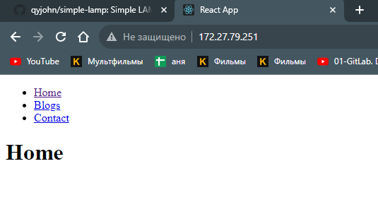

### 1. Написать Dockerfile для React приложения. Можно сгенерировать ресурсы для веб-сайта (HTML/CSS/JS файлы) прямо из исходников, а можно уже взять готовые из папки build. Собрать образ, запустить и проверить работоспособность приложения в контейнере.
```bash
test@DESKTOP-SDPV7KD:/mnt/d/devops_curs/mikalai-vabishchevich/hw20/react_nginx$ cat Dockerfile 
FROM node:slim AS build

WORKDIR /app

COPY package*.json /app/
RUN npm ci

COPY . /app/
RUN npm run build

FROM nginx

RUN sed -i "/index  index.html index.htm;/a\        try_files \$uri /index.html;" /etc/nginx/conf.d/default.conf

COPY --from=build /app/build/ /usr/share/nginx/html
test@DESKTOP-SDPV7KD:/mnt/d/devops_curs/mikalai-vabishchevich/hw20/react_nginx$ docker build .
[+] Building 130.1s (15/15) FINISHED                                                       docker:default
 => [internal] load build definition from Dockerfile                                                 0.0s
 => => transferring dockerfile: 340B                                                                 0.0s 
 => [internal] load .dockerignore                                                                    0.0s 
 => => transferring context: 2B                                                                      0.0s 
 => [internal] load metadata for docker.io/library/nginx:latest                                      1.0s 
 => [internal] load metadata for docker.io/library/node:slim                                         1.0s 
 => [build 1/6] FROM docker.io/library/node:slim@sha256:9cbf7eced7de09dcc8d0bd159232c52b64de722ce5f  0.0s
 => [internal] load build context                                                                    0.2s 
 => => transferring context: 1.96kB                                                                  0.2s 
 => [stage-1 1/3] FROM docker.io/library/nginx@sha256:4d2f2056993a84b7b9832c7612c5900c26ecd908bd2ba  0.0s 
 => CACHED [stage-1 2/3] RUN sed -i "/index  index.html index.htm;/a\        try_files $uri /index.  0.0s 
 => CACHED [build 2/6] WORKDIR /app                                                                  0.0s 
 => [build 3/6] COPY package*.json /app/                                                             0.0s
 => [build 4/6] RUN npm ci                                                                         117.0s 
 => [build 5/6] COPY . /app/                                                                         0.1s
 => [build 6/6] RUN npm run build                                                                   10.9s 
 => [stage-1 3/3] COPY --from=build /app/build/ /usr/share/nginx/html                                0.1s 
 => exporting to image                                                                               0.1s 
 => => exporting layers                                                                              0.1s 
 => => writing image sha256:a4b9497023cfab4d834b0833379ec5ac95146d338ea14b9d006b567e64b4cba0         0.0s 
test@DESKTOP-SDPV7KD:/mnt/d/devops_curs/mikalai-vabishchevich/hw20/react_nginx$ sudo docker images        
[sudo] password for test: 
REPOSITORY                 TAG       IMAGE ID       CREATED         SIZE
<none>                     <none>    a4b9497023cf   5 minutes ago   188MB
<none>                     <none>    ceddc659a90e   3 days ago      188MB
docker/welcome-to-docker   latest    c1f619b6477e   2 weeks ago     18.6MB
jenkins/jenkins            latest    283d4c216d6f   2 weeks ago     476MB
test@DESKTOP-SDPV7KD:/mnt/d/devops_curs/mikalai-vabishchevich/hw20/react_nginx$ docker run -p 80:80 a4b9497023cf
/docker-entrypoint.sh: /docker-entrypoint.d/ is not empty, will attempt to perform configuration
/docker-entrypoint.sh: Looking for shell scripts in /docker-entrypoint.d/
/docker-entrypoint.sh: Launching /docker-entrypoint.d/10-listen-on-ipv6-by-default.sh
10-listen-on-ipv6-by-default.sh: info: Getting the checksum of /etc/nginx/conf.d/default.conf
10-listen-on-ipv6-by-default.sh: info: /etc/nginx/conf.d/default.conf differs from the packaged version
/docker-entrypoint.sh: Sourcing /docker-entrypoint.d/15-local-resolvers.envsh
/docker-entrypoint.sh: Launching /docker-entrypoint.d/20-envsubst-on-templates.sh
/docker-entrypoint.sh: Launching /docker-entrypoint.d/30-tune-worker-processes.sh
/docker-entrypoint.sh: Configuration complete; ready for start up
2023/11/21 21:38:45 [notice] 1#1: using the "epoll" event method
2023/11/21 21:38:45 [notice] 1#1: nginx/1.25.3
2023/11/21 21:38:45 [notice] 1#1: built by gcc 12.2.0 (Debian 12.2.0-14)
2023/11/21 21:38:45 [notice] 1#1: OS: Linux 5.15.133.1-microsoft-standard-WSL2
2023/11/21 21:38:45 [notice] 1#1: getrlimit(RLIMIT_NOFILE): 1048576:1048576
2023/11/21 21:38:45 [notice] 1#1: start worker processes
2023/11/21 21:38:45 [notice] 1#1: start worker process 28
2023/11/21 21:38:45 [notice] 1#1: start worker process 29
2023/11/21 21:38:45 [notice] 1#1: start worker process 30
2023/11/21 21:38:45 [notice] 1#1: start worker process 31
2023/11/21 21:38:45 [notice] 1#1: start worker process 32
2023/11/21 21:38:45 [notice] 1#1: start worker process 33
2023/11/21 21:38:45 [notice] 1#1: start worker process 34
2023/11/21 21:38:45 [notice] 1#1: start worker process 35
172.17.0.1 - - [21/Nov/2023:21:39:22 +0000] "GET / HTTP/1.1" 200 584 "-" "Mozilla/5.0 (Windows NT 10.0; Win64; x64) AppleWebKit/537.36 (KHTML, like Gecko) Chrome/119.0.0.0 Safari/537.36" "-"
172.17.0.1 - - [21/Nov/2023:21:39:22 +0000] "GET /static/js/main.1678be86.js HTTP/1.1" 200 169982 "http://172.27.79.251/" "Mozilla/5.0 (Windows NT 10.0; Win64; x64) AppleWebKit/537.36 (KHTML, like Gecko) Chrome/119.0.0.0 Safari/537.36" "-"
2023/11/21 21:39:30 [notice] 1#1: signal 28 (SIGWINCH) received
```

### 2. Написать Dockerfile для LAMP приложения, который устанавливает весь LAMP стек в один образ. Подсказка: для того, чтобы в Docker контейнере запускались службы, нужно установить systemd и задать его как ENTRYPOINT, а также запускать контейнер в привилегированном режиме. Например, как тут.
```bash


```
### 3. Написать Dockerfile для LAMP приложения, который устанавливает только само приложение в Apache используя php:apache Docker образ. Написать docker-compose.yaml, который разворачивает зависимости приложения (MySQL и Memcached) и запускает само приложение. Обратить внимание на /docker-entrypoint-initdb.d mount для MySQL, использование которого описано в документации к MySQL Docker образу. Посмотреть, что такое wait-for-it.sh и придумать, как его можно заиспользовать в этом задании.
```bash


```
### 4. (**) Запустить Java приложение с помощью docker-compose.yml, находящемся в репозитории.
```bash

```
### 5. (**) Написать Ansible playbook, который будет устанавливать Docker и Docker Compose на целевую VM с помощью роли, а затем будет запускать одно из следующих приложений с помощью Docker Compose:
- LAMP приложение
- Java приложение
- Nginx/PHP/MySQL приложение
Продумать какие переменные будут доступны для пользователя Ansible playbook и каким образом они будут встраиваться в docker-compose.yml.
```bash

```
### 6. (**) В качестве эксперимента, установить некоторую зависимость приложения (например, БД) из предыдущего пункта как сервис на VM при помощи Ansible роли. Само приложение оставить в Docker и настроить на работу с зависимостью на VM.
```bash

```