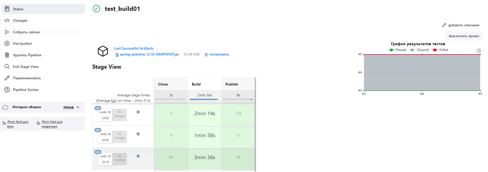
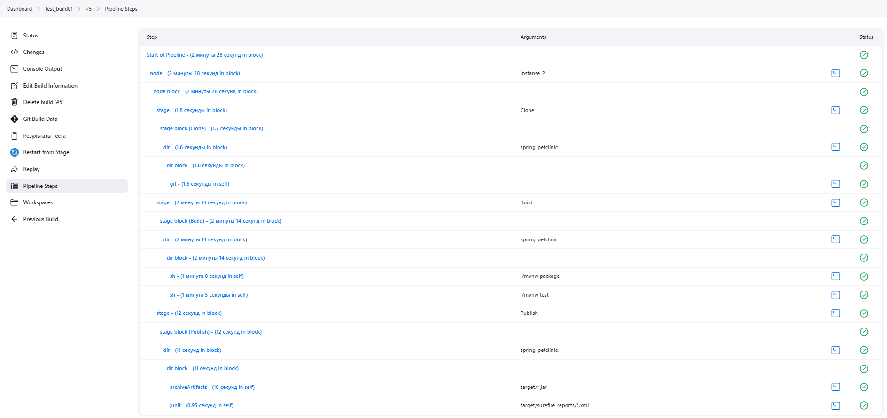
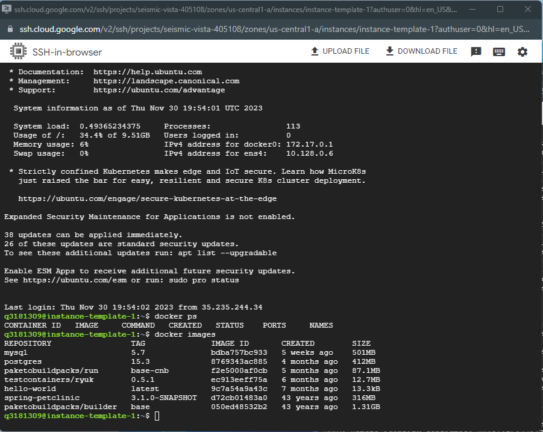

### 1. Познакомиться с описанием проекта spring-petclinic, изучить какие инструменты нужны для его сборки.
### 2. Создать статический Jenkins агент (можно использовать WSL), установить туда инструменты, необходимые для сборки проекта.
### 3. Реализовать Jenkinsfile для проекта, который состоит из следующих этапов (stages):
- Clone
- Клонируется данный проект. Обратите внимание, что этот репозиторий приватный и для того, чтобы его склонировать нужно использовать какие-то credentials. Необходимо создать нужные credentials в Jenkins и сослаться на них при написании pipeline.
- Build
- Происходит сборка проекта через Maven или Gradle и запускаются юнит-тесты.
- Publish
- Публикуется артефакт сборки с помощью инструкции archiveArtifacts.
- Публикуется отчёт тестирования с помощью инструкции junit.

### 4. Настроить сборку по расписанию (каждый час) при помощи блока triggers в Jenkinsfile.

### 5. (**) Реализовать Dockerfile для данного проекта и изменить стадию Build таким образом, чтобы она строила Docker образ. Стадию Publish в данном случае можно пропустить.

