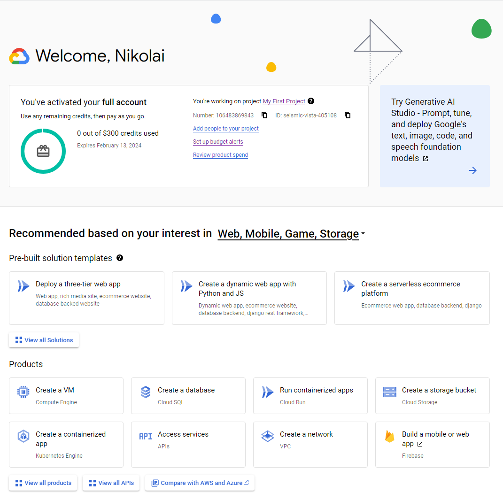
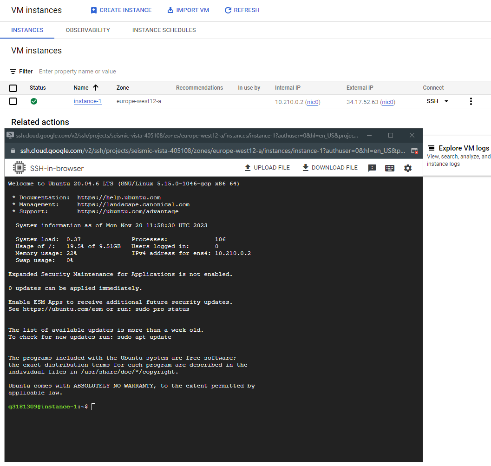
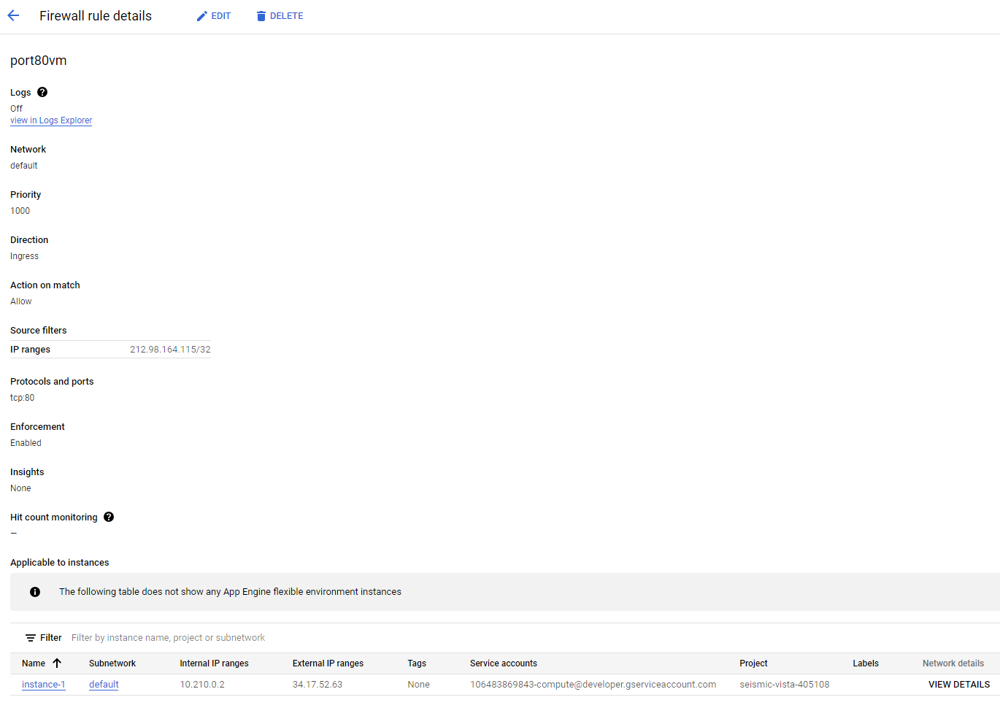
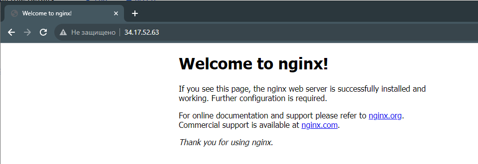

### 1. Зарегистрироваться на облачном провайдере Google Cloud Platform (GCP)
- В качестве локации указать Грузию.
- Привязать банковскую карту РБ/РФ.
- Получить кредиты от GCP (300$) путем верификации карты.

### 2. Настроить предупреждения для бюджета (например, 50$ на месяц).

### 3. Создать свою первую VM в облаке, зайти на неё по SSH и установить Nginx/Apache.

### 4. Создать Firewall правило для подключения к этой VM со своей локальной машины по порту 80. Проверить, что доступ работает.

