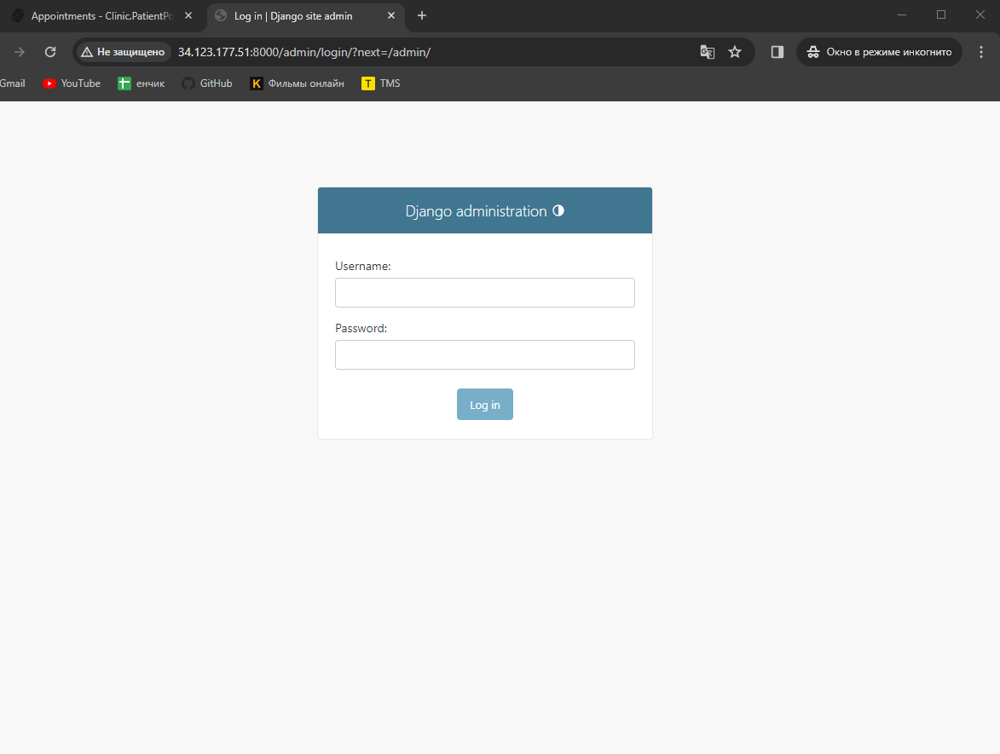

### 1. Установить приложение Clinic v1 в Google Cloud Platform согласно инструкции. Для хостинга БД использовать Google Cloud SQL поддержкой соединений только во внутренней сети (иными словами, БД будет доступна только по внутреннему/приватному IP). Сами сервисы установить на виртуальные машины Google Compute Engine (GCE) с ОС Debian 12. Проверить работоспособность приложения путём создания записи на приём к любому врачу.

#### - Portal
```bash
q3181309@instance-3:~$ cd /var/www/clinic/portal
q3181309@instance-3:/var/www/clinic/portal$ sudo rm -R .venv/
q3181309@instance-3:/var/www/clinic/portal$ python3.11 -m venv .venv
q3181309@instance-3:/var/www/clinic/portal$ . .venv/bin/activate
(.venv) q3181309@instance-3:/var/www/clinic/portal$ pip3 install -r requirements.txt
Collecting asgiref==3.7.2 (from -r requirements.txt (line 1))
  Obtaining dependency information for asgiref==3.7.2 from https://files.pythonhosted.org/packages/9b/80/b9051a4a07ad231558fcd8ffc89232711b4e618c15cb7a392a17384bbeef/asgiref-3.7.2-py3-none-any.whl.metadata
  Downloading asgiref-3.7.2-py3-none-any.whl.metadata (9.2 kB)
Collecting Django==4.2.5 (from -r requirements.txt (line 2))
  Obtaining dependency information for Django==4.2.5 from https://files.pythonhosted.org/packages/bf/8b/c38f2354b6093d9ba310a14b43a830fdf776edd60c2e25c7c5f4d23cc243/Django-4.2.5-py3-none-any.whl.metadata
  Downloading Django-4.2.5-py3-none-any.whl.metadata (4.1 kB)
Collecting djangorestframework==3.14.0 (from -r requirements.txt (line 3))
  Using cached djangorestframework-3.14.0-py3-none-any.whl (1.1 MB)
Collecting mysqlclient==2.2.0 (from -r requirements.txt (line 4))
  Using cached mysqlclient-2.2.0.tar.gz (89 kB)
  Installing build dependencies ... done
  Getting requirements to build wheel ... done
  Installing backend dependencies ... done
  Preparing metadata (pyproject.toml) ... done
Collecting python-dotenv==1.0.0 (from -r requirements.txt (line 5))
  Using cached python_dotenv-1.0.0-py3-none-any.whl (19 kB)
Collecting pytz==2023.3.post1 (from -r requirements.txt (line 6))
  Obtaining dependency information for pytz==2023.3.post1 from https://files.pythonhosted.org/packages/32/4d/aaf7eff5deb402fd9a24a1449a8119f00d74ae9c2efa79f8ef9994261fc2/pytz-2023.3.post1-py2.py3-none-any.whl.metadata
  Downloading pytz-2023.3.post1-py2.py3-none-any.whl.metadata (22 kB)
Collecting sqlparse==0.4.4 (from -r requirements.txt (line 7))
  Using cached sqlparse-0.4.4-py3-none-any.whl (41 kB)
Collecting tzdata==2023.3 (from -r requirements.txt (line 8))
  Using cached tzdata-2023.3-py2.py3-none-any.whl (341 kB)
Using cached asgiref-3.7.2-py3-none-any.whl (24 kB)
Using cached Django-4.2.5-py3-none-any.whl (8.0 MB)
Using cached pytz-2023.3.post1-py2.py3-none-any.whl (502 kB)
Building wheels for collected packages: mysqlclient
  Building wheel for mysqlclient (pyproject.toml) ... done
  Created wheel for mysqlclient: filename=mysqlclient-2.2.0-cp311-cp311-linux_x86_64.whl size=125949 sha256=c86cac15ae3ffba3a5b18f3fdf01a8b10eddf3a2c4ed770d57063f98e34d3a47
  Stored in directory: /home/q3181309/.cache/pip/wheels/a4/97/41/1e55ebbb29ce69d9008782f457658f48755b861fa145538ca0
Successfully built mysqlclient
Installing collected packages: pytz, tzdata, sqlparse, python-dotenv, mysqlclient, asgiref, Django, djangorestframework
Successfully installed Django-4.2.5 asgiref-3.7.2 djangorestframework-3.14.0 mysqlclient-2.2.0 python-dotenv-1.0.0 pytz-2023.3.post1 sqlparse-0.4.4 tzdata-2023.3

[notice] A new release of pip is available: 23.2.1 -> 23.3.1
[notice] To update, run: pip install --upgrade pip
(.venv) q3181309@instance-3:/var/www/clinic/portal$ sudo cat .env 
ALLOWED_HOSTS=34.123.177.51 10.128.0.11
SECRET_KEY=django-insecure-w6rzzkjq-j&fxq^9)1c+nj#zp3lp$kh8&h4fkw9yue8c$ygbuy

DB_HOST=10.28.1.9
DB_NAME=clinic
DB_USER=clinic
DB_PASSWORD=password
(.venv) q3181309@instance-3:/var/www/clinic/portal$ python3 manage.py runserver 0.0.0.0:8000
```




#### - Portal.Patient
```bash

q3181309@instance-2:/var/www/clinic/patientportal$ wget https://packages.microsoft.com/config/debian/12/packages-microsoft-prod.deb -O packages-microsoft-prod.deb
--2023-12-13 22:51:10--  https://packages.microsoft.com/config/debian/12/packages-microsoft-prod.deb
Resolving packages.microsoft.com (packages.microsoft.com)... 13.66.21.183
Connecting to packages.microsoft.com (packages.microsoft.com)|13.66.21.183|:443... connected.
HTTP request sent, awaiting response... 200 OK
Length: 4304 (4.2K) [application/octet-stream]
Saving to: ‘packages-microsoft-prod.deb’

packages-microsoft-prod.deb 100%[==========================================>]   4.20K  --.-KB/s    in 0s      

2023-12-13 22:51:10 (571 MB/s) - ‘packages-microsoft-prod.deb’ saved [4304/4304]

q3181309@instance-2:/var/www/clinic/patientportal$ sudo dpkg -i packages-microsoft-prod.deb
q3181309@instance-2:/var/www/clinic/patientportal$ sudo apt-get update &&   sudo apt-get install -y dotnet-sdk-6.0
q3181309@instance-2:/var/www/clinic/patientportal$ sudo apt-get install -y dotnet-runtime-6.0 
q3181309@instance-2:/var/www/clinic/patientportal$ sudo apt-get install -y aspnetcore-runtime-6.0 
q3181309@instance-2:/var/www/clinic/patientportal$ openssl req -x509 -nodes -days 365 -subj "/CN=34.42.201.217" -newkey rsa:2048 -keyout cert.key -out cert.crt
q3181309@instance-2:/var/www/clinic/patientportal$ sudo openssl req -x509 -nodes -days 365 -subj "/CN=34.42.201.217" -newkey rsa:2048 -keyout cert.key -out cert.crt
q3181309@instance-2:/var/www/clinic/patientportal$ dotnet Clinic.PatientPortal.dll --urls https://0.0.0.0:443
q3181309@instance-2:/var/www/clinic/patientportal$ sudo nano appsettings.json 
q3181309@instance-2:/var/www/clinic/patientportal$ mysql -upatient -p clinic --host=10.28.1.9
q3181309@instance-2:/var/www/clinic/patientportal$ cat appsettings.json 
{
  "ConnectionStrings": {
    "DefaultConnection": "server=10.28.1.9;database=clinic;user=patient;password=password"
  },
  "ClinicPortal": {
    "Uri": "http://10.128.0.11:8000/"
  },
  "GitHub": {
    "ClientId": "6d2491a41d5c9a523d98",
    "ClientSecret": "13467c694aeb7a8006ed97cc1470731f57b523dc",
    "EnterpriseDomain": ""
  },
  "Kestrel": {
    "Certificates": {
      "Default": {
        "KeyPath": "cert.key",
        "Path": "cert.crt"
      }
    }
  },
  "Logging": {
    "LogLevel": {
      "Default": "Information",
      "Microsoft.AspNetCore": "Warning"
    }
  },
  "AllowedHosts": "*"
}
```

