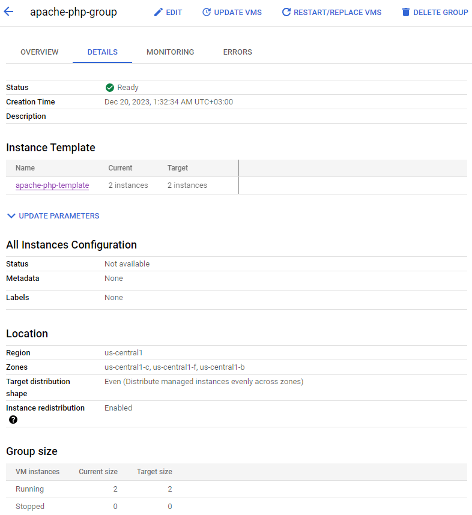

### 1. Работа с Google Cloud Storage (GCS):
- Создать GCE, открыть SSH сессию в созданную VM.
- Cклонировать репозиторий и ознакомиться с проектом и инструкцией к нему.
- Создать необходимые ресурсы для работы приложения:
- Создать GCS Bucket <LASTNAME>-gcs-demo.

- Создать Service Account <LASTNAME>-gcs-demo и назначьте ему роль Storage Object Admin (IAM & Admin -> IAM -> GRANT ACCESS)

- Сгенерировать и скачать Service Account Key в формате JSON.

- Установить Node.js 18.
```bash
    q3181309@instance-4:~$ sudo apt-get update
    q3181309@instance-4:~/google-cloud-storage-nodejs-upload-file$ sudo mkdir -p /etc/apt/keyrings
    q3181309@instance-4:~/google-cloud-storage-nodejs-upload-file$ curl -fsSL https://deb.nodesource.com/gpgkey/nodesource-repo.gpg.key | sudo gpg --dearmor -o /etc/apt/keyrings/nodesource.gpg
    q3181309@instance-4:~/google-cloud-storage-nodejs-upload-file$ NODE_MAJOR=18
    q3181309@instance-4:~/google-cloud-storage-nodejs-upload-file$ echo "deb [signed-by=/etc/apt/keyrings/nodesource.gpg] https://deb.nodesource.com/node_$NODE_MAJOR.x nodistro main" | sudo tee /etc/apt/sources.list.d/nodesource.list
    deb [signed-by=/etc/apt/keyrings/nodesource.gpg] https://deb.nodesource.com/node_18.x nodistro main
    q3181309@instance-4:~/google-cloud-storage-nodejs-upload-file$ sudo apt-get update
```
- Установить зависимости приложения через NPM.
```bash
    q3181309@instance-4:~/google-cloud-storage-nodejs-upload-file$ npm install

    up to date, audited 160 packages in 928ms

    17 packages are looking for funding
    run `npm fund` for details

    found 0 vulnerabilities

    q3181309@instance-4:~/google-cloud-storage-nodejs-upload-file$ node server.js
```

- Поправить имя GCS Bucket и имя файла с Service Account Key в каком-то из .js файлов приложения.
```bash
    nano src/controller/file.controller.js 
    ...
    const processFile = require("../middleware/upload");
    const { format } = require("util");
    const { Storage } = require("@google-cloud/storage");

    const storage = new Storage({ keyFilename: "google-cloud-key.json" });
    const bucket = storage.bucket("vabischevich-gcs-demo");
    ...
```
- Запустить приложение и проверить его работоспособность путем выполнение нескольких HTTP запросов через Postman как описано в Node.js upload File to Google Cloud Storage example параграфе.


### 2. Настройка автомасштабирования:
- Создать шаблон виртуальной машины apache-php-template

- Активировать Allow HTTP traffic.

- В качестве startup скрипта написать команды для установки Apache веб-сервера с поддержкой PHP и создания phpinfo страницы (<?php phpinfo(); ?>).
```bash
    #!/bin/bash
    sudo apt update -y 
    sudo apt install apache2 php libapache2-mod-php php-mysql -y
    sudo rm /var/www/html/index.html
    echo '<html><?php phpinfo();?></html>' > /var/www/html/index.php
```

- Создать группу виртуальных машин apache-php-group с помощью шаблона apache-php-template

- Использовать мультизональную локацию.
- Настроить автомасштабирование от 2 до 4 экземпляров.
- Понизить порог для автомасштабирования до 30% CPU.

- Создать Application Load Balancer:
- В качестве Backend использовать ранее созданную группу VM apache-php-group:
- Выключить Cloud CDN.
- В качестве, Health Check использовать просто проверку доступности домашней страницы Apache.
- Проверить распределение трафика путем выполнения HTTP запроса GET /index.php через Load Balancer и сравнения свойства SERVER_ADDR в phpinfo таблице.
- Сгенерировать нагрузку на Load Balancer и убедиться, что работает автомасштабирование.


