1. Создать Firewall правило DenyAll с низким приоритетом, которое блокирует трафик из любой сети в любую сеть на любом порту. Включить логирование для этого правила.

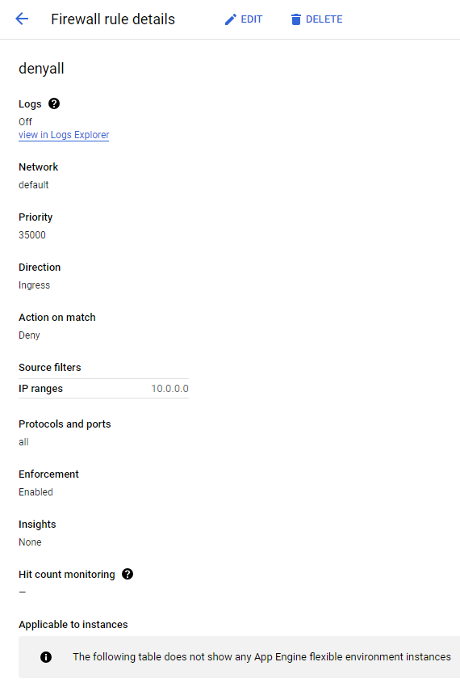

2. Зайти в Logs Storage и активировать опцию Log Analytics для _Default Log bucket.

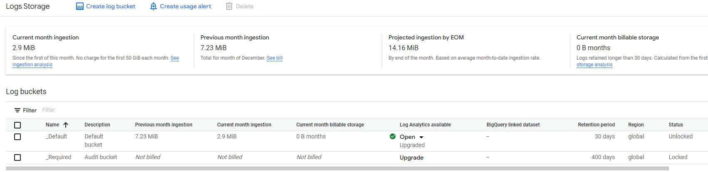

3. Создать 2 VM в одной сети, но разных подсетях.

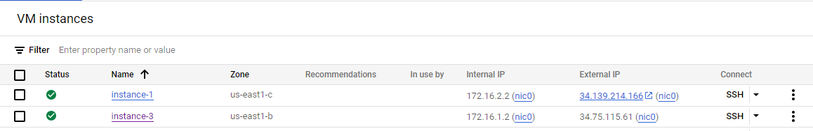

4. Выполнить ping одной VM из другой. В случае, если ping не работает, посмотреть логи. Сделать так, чтобы ping работал 😊

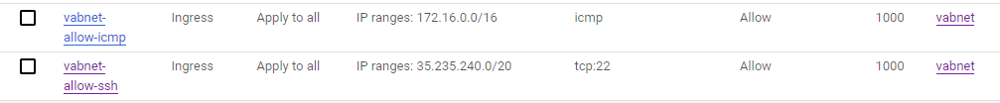
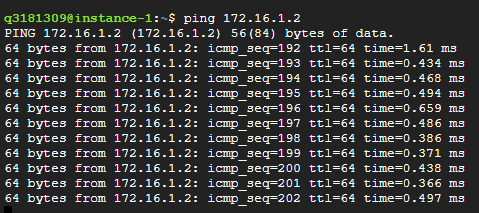

5. Создать новую сеть и подсеть в том регионе, где была создана одна из VM, и перенести эту VM в созданную подсеть новой сети. Иными словами, поменять/добавить этой VM сетевой интерфейс.

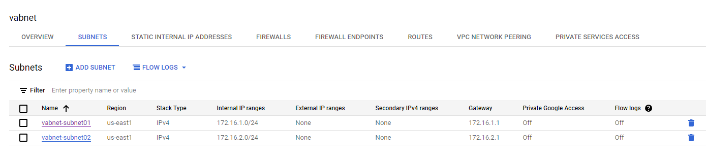
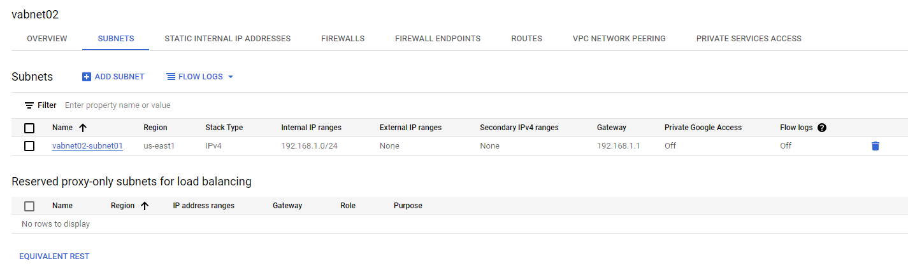
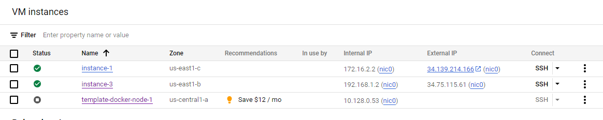
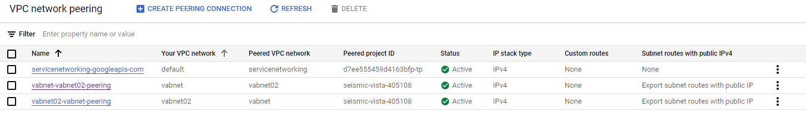


6. Выполнить ping этой VM из ранее созданной. В случае, если ping не работает, посмотреть логи.


7. Настроить пиринг между сетями. Снова попробовать пинг, снова посмотреть логи. Сделать так, чтобы ping работал.

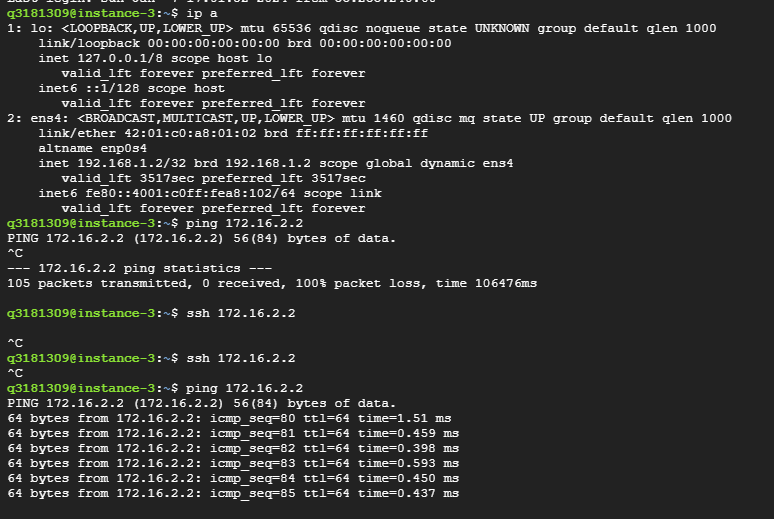

8. Найти пример приложения для App Engine Standard Environment и установить его.
```bash
q3181309@cloudshell:~ (seismic-vista-405108)$ git clone https://github.com/Kamparia/google-app-engine-sample.git
Cloning into 'google-app-engine-sample'...
remote: Enumerating objects: 52, done.
remote: Counting objects: 100% (52/52), done.
remote: Compressing objects: 100% (32/32), done.
remote: Total 52 (delta 17), reused 43 (delta 12), pack-reused 0
Receiving objects: 100% (52/52), 14.12 KiB | 7.06 MiB/s, done.
Resolving deltas: 100% (17/17), done.
q3181309@cloudshell:~ (seismic-vista-405108)$ ll
total 56
drwxr-xr-x 8 q3181309 q3181309 4096 Jan 16 21:22 ./
drwxr-xr-x 4 root     root     4096 Nov 22 13:28 ../
-rw------- 1 q3181309 q3181309 3579 Jan 16 21:22 .bash_history
-rw-r--r-- 1 q3181309 q3181309  220 Jan  1  1970 .bash_logout
-rw-r--r-- 1 q3181309 q3181309 3564 Nov  5 09:25 .bashrc
drwxr-xr-x 3 q3181309 q3181309 4096 Nov 23 09:00 .cache/
drwxr-xr-x 3 q3181309 q3181309 4096 Nov  5 09:14 .config/
drwxr-xr-x 2 q3181309 q3181309 4096 Nov 22 13:28 .docker/
drwxr-xr-x 4 q3181309 q3181309 4096 Jan 16 21:22 google-app-engine-sample/
drwxr-xr-x 3 q3181309 q3181309 4096 Nov 22 13:28 .npm/
-rw-r--r-- 1 q3181309 q3181309  807 Jan  1  1970 .profile
-rw-r--r-- 1 q3181309 q3181309  913 Jan 16 21:22 README-cloudshell.txt
drwxr-xr-x 7 q3181309 q3181309 4096 Nov 23 09:00 .theia/
-rw-r--r-- 1 q3181309 q3181309  165 Dec  6 11:23 .wget-hsts
q3181309@cloudshell:~ (seismic-vista-405108)$ cd google-app-engine-sample/
q3181309@cloudshell:~/google-app-engine-sample (seismic-vista-405108)$ ll
total 52
drwxr-xr-x 4 q3181309 q3181309  4096 Jan 16 21:22 ./
drwxr-xr-x 8 q3181309 q3181309  4096 Jan 16 21:22 ../
-rw-r--r-- 1 q3181309 q3181309    17 Jan 16 21:22 app.yaml
drwxr-xr-x 8 q3181309 q3181309  4096 Jan 16 21:22 .git/
-rw-r--r-- 1 q3181309 q3181309    20 Jan 16 21:22 .gitignore
-rw-r--r-- 1 q3181309 q3181309 11357 Jan 16 21:22 LICENSE
-rw-r--r-- 1 q3181309 q3181309   140 Jan 16 21:22 main.py
-rw-r--r-- 1 q3181309 q3181309    91 Jan 16 21:22 README.md
-rw-r--r-- 1 q3181309 q3181309    14 Jan 16 21:22 requirements.txt
-rw-r--r-- 1 q3181309 q3181309    12 Jan 16 21:22 runtime.txt
drwxr-xr-x 2 q3181309 q3181309  4096 Jan 16 21:22 templates/
q3181309@cloudshell:~/google-app-engine-sample (seismic-vista-405108)$ gcloud app deploy
Services to deploy:

descriptor:                  [/home/q3181309/google-app-engine-sample/app.yaml]
source:                      [/home/q3181309/google-app-engine-sample]
target project:              [seismic-vista-405108]
target service:              [default]
target version:              [20240116t212334]
target url:                  [https://seismic-vista-405108.uc.r.appspot.com]
target service account:      [106483869843-compute@developer.gserviceaccount.com]


Do you want to continue (Y/n)?  y

Beginning deployment of service [default]...
Created .gcloudignore file. See `gcloud topic gcloudignore` for details.
Uploading 8 files to Google Cloud Storage
12%
25%
38%
50%
62%
75%
88%
100%
100%
File upload done.
Updating service [default]...done.                                                                                                                                                                                                              
Setting traffic split for service [default]...done.                                                                                                                                                                                             
Deployed service [default] to [https://seismic-vista-405108.uc.r.appspot.com]

You can stream logs from the command line by running:
  $ gcloud app logs tail -s default

To view your application in the web browser run:
  $ gcloud app browse
q3181309@cloudshell:~/google-app-engine-sample (seismic-vista-405108)$

```
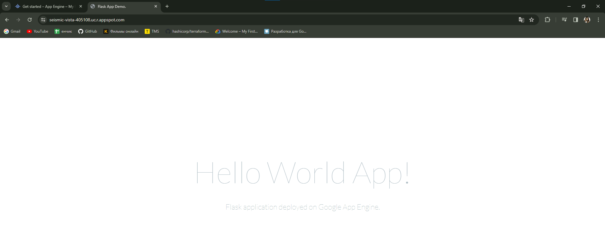

9. Найти пример приложения для App Engine Flexible Environment и установить его.

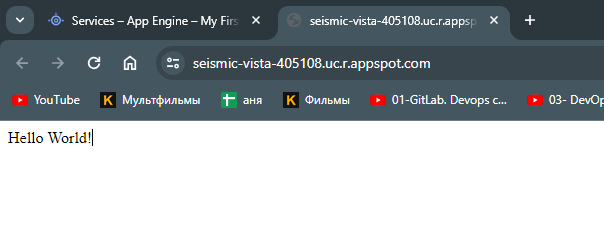

